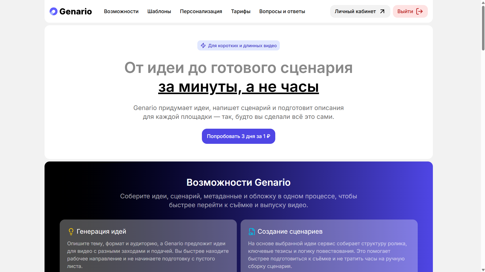
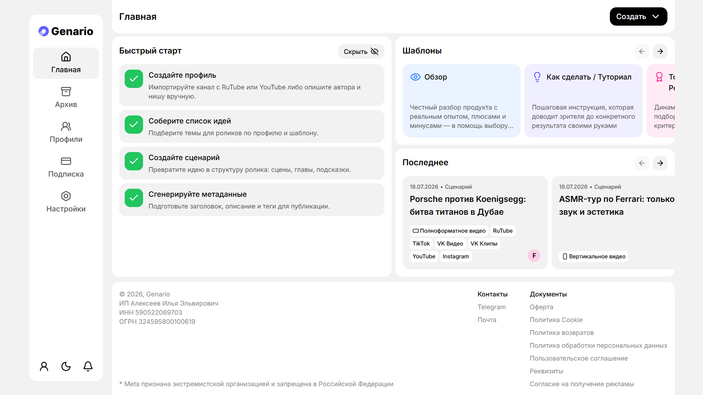
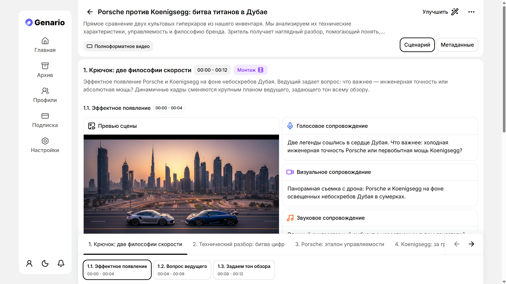
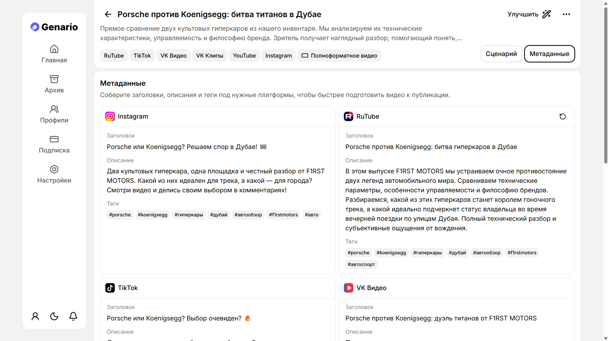

# Genario — Web Client

**Genario turns a rough video idea into a production-ready script.** It generates content
ideas for a creator's channel, expands a chosen idea into a full shooting script
(chapters → scenes → voice-over, visual and sound directions), renders preview images for
individual scenes, and writes publication metadata — titles, descriptions and tags —
tailored to each platform: YouTube, Instagram, TikTok, RuTube, VK Video, VK Clips and Dzen.

This repository holds the **web client**: a React 19 + TypeScript single-page application.
The product interface is in Russian; this document is in English.

> **Companion repositories:** [backend](https://github.com/genario-ru/backend) ·
> [monitoring](https://github.com/genario-ru/monitoring)

---

## The problem

A creator publishing regularly spends hours on work that happens *before* the camera turns
on: finding a topic that fits the channel, structuring the video so it holds attention,
writing the voice-over, deciding what is on screen at each moment, and then rewriting the
title and description separately for every platform. Most of that is repetitive
scaffolding rather than creative decision-making.

Genario keeps the creative decisions with the human and automates the scaffolding. The
user describes their channel once — positioning, audience, tone, reference videos — and
every later generation is grounded in that profile, so the output reads like their own
work instead of generic AI text.

---

## Screenshots

<table>
  <tr>
    <td width="50%" valign="top">
      <br>
      <sub><b>Landing.</b> Public marketing page, served by the same SPA.</sub>
    </td>
    <td width="50%" valign="top">
      <br>
      <sub><b>Dashboard.</b> Onboarding checklist, script templates and recent work.</sub>
    </td>
  </tr>
  <tr>
    <td width="50%" valign="top">
      <br>
      <sub><b>Script.</b> Chapters and scenes with timecodes, voice-over, visual and sound
      directions, plus an AI-generated scene preview.</sub>
    </td>
    <td width="50%" valign="top">
      <br>
      <sub><b>Metadata.</b> Per-platform titles, descriptions and tags generated from the
      finished script.</sub>
    </td>
  </tr>
</table>

---

## How the product works

| Step | What the user does | What the system does |
| --- | --- | --- |
| **1. Profile** | Imports a YouTube/RuTube channel or describes the author, niche, audience and tone by hand; attaches reference videos, portraits and cover art | Pulls channel videos through an external video API, enriches them, and derives a reusable creative profile |
| **2. Ideas** | Picks a template (review, tutorial, top-N, …), a tone and a target platform | Generates a list of video ideas grounded in the profile |
| **3. Script** | Selects an idea | Builds chapters, then scenes inside each chapter — each with a timecode, voice-over line, visual direction and sound direction |
| **4. Previews** | Requests a preview for a scene | Generates a still image illustrating that scene |
| **5. Metadata** | Chooses the platforms to publish on | Writes a separate title, description and tag set per platform |
| **6. Delivery** | Exports or revisits work | Renders DOCX/PDF exports; everything stays versioned and searchable in the archive |

Steps 2–5 are long-running AI jobs executed by backend workers, not synchronous requests.
The client is therefore built around **job state** — pending, running, failed, ready — and
around partial results that appear in the UI as each chapter or scene completes.

---

## Tech stack

| Area | Choice |
| --- | --- |
| Language / runtime | TypeScript (strict), React 19 |
| Build | Vite 6, `tsc --noEmit` as a build gate, hidden source maps |
| Routing | TanStack Router — file-based, automatic code splitting, typed search params via Zod |
| Server state | TanStack Query |
| Client state | Zustand |
| Forms | TanStack Form with Zod 4 schemas |
| Styling | Tailwind CSS v4, `class-variance-authority`, `tailwind-merge` |
| Components | Radix UI and Base UI primitives, `cmdk`, `sonner`, Swiper, React Spring |
| API layer | Kubb — TypeScript types, Zod schemas and React Query hooks generated from the backend's OpenAPI document |
| i18n / theming | i18next (`en`/`ru`, typed resources), `next-themes` for light and dark |
| Observability | Sentry SDK reporting to a self-hosted GlitchTip, Yandex Metrika, `web-vitals` |
| PWA | `vite-plugin-pwa` (Workbox) with an installable manifest |
| Quality | ESLint 9 flat config (React, hooks, `jsx-a11y`, `security`, `import`, `simple-import-sort`), Prettier |

---

## Architecture

The app follows a pragmatic **Feature-Sliced Design** layout. Imports flow strictly
downwards — a lower layer never reaches back up into a higher one.

```text
src/
  routes/        TanStack Router file routes — URL structure and access boundaries
  entrypoints/   Page-level composition; one folder per screen
  widgets/       Large self-contained domain blocks (scenario editor, billing, profiles)
  features/      Reusable domain UI and small domain helpers
  actions/       Business hooks wrapping API queries, mutations and cache invalidation
  shared/        Cross-domain UI kit, hooks, utils, constants, types
  lib/           Technical infrastructure (API client, auth, i18n, query/router/form setup)
  codegen/       Generated API client and route tree — never edited by hand
  globals/       Ambient TypeScript declarations
```

| Layer | Answers the question |
| --- | --- |
| `routes` | *Where does this live, and who is allowed in?* |
| `entrypoints` | *What does this page consist of?* |
| `widgets` | *What is this large domain block?* |
| `features` | *What reusable domain piece does it use?* |
| `actions` | *How does the app talk to the API for this domain?* |
| `shared` / `lib` | *What generic building blocks and infrastructure exist?* |

---

## Core engineering decisions

### A fully generated, fully typed API layer

The backend publishes an OpenAPI document, and Kubb turns it into TypeScript types, Zod
schemas and ready-made React Query hooks under `src/codegen/api/**`. Nothing about the API
contract is hand-written on the client, so a breaking backend change surfaces as a compile
error instead of a runtime bug in production. `src/actions/**` wraps those generated hooks
with the product's own caching, invalidation and error semantics.

### Routing as the authorization boundary

Access control lives in the route tree itself rather than scattered across components:

```text
_auth/                     unauthenticated only (sign-in, OTP verification)
_without-auth/             public (landing, tariffs, legal documents, credit packages)
_with-auth/
  _with-subscription/      requires an active subscription
  _without-subscription/   authenticated, subscription not required
```

A layout route resolves session and subscription once, and every screen beneath it
inherits that guarantee: an authenticated screen cannot render without a session, because
the router never constructs it.

### Server state and client state stay apart

Everything owned by the backend lives in TanStack Query, with cache keys derived from the
generated client. Zustand holds only genuinely local UI state. No global store mirrors
server data, which removes an entire class of "the store and the server disagree" bugs.

### Built for asynchronous generation

Because generations run as background jobs, screens are designed around progressive
states: skeletons while a chapter is still being written, per-scene loading for previews,
recoverable failure states, and cache invalidation as results land — rather than one
blocking spinner.

### Deployment freshness in the service worker

The PWA config deliberately keeps `index.html` **out** of the precache and serves
navigation requests `NetworkFirst` with a three-second timeout, falling back to cache when
offline. A stale service worker therefore cannot pin users to a previous release — a
common failure mode of naive Workbox setups — while offline support is preserved.

---

## Security-relevant decisions

- **No secrets ship in the bundle.** Every environment-dependent value (API base URL,
  GlitchTip DSN, analytics ID) is injected at build time and read through a single `envs`
  module; there are no hard-coded fallbacks pointing at production.
- **No tokens in web storage.** Sessions are backend-issued cookies; the client never
  reads, stores or forwards a bearer token.
- **Passwordless authentication.** Sign-in is email OTP, so the client never handles,
  validates or transmits a password.
- **Hidden source maps.** Production builds emit source maps for the error tracker without
  referencing them from shipped assets.
- **Static analysis for unsafe patterns.** `eslint-plugin-security` and
  `eslint-plugin-jsx-a11y` run across the codebase as part of linting.
- **Explicit consent and a real legal surface.** Cookie consent, offer, privacy policy,
  refund policy and marketing-consent documents are first-class routes served from the
  backend.

---

## Delivery

Pushes to `stage` and `prod` build a Docker image, publish it to GitHub Container
Registry, and trigger a Dokploy deployment of the matching environment. Every credential
the pipeline uses comes from GitHub Actions secrets. Each build carries a release
identifier that is forwarded to GlitchTip, so a production error can be traced back to the
exact commit that introduced it.

---

## Repository map

| Path | Contents |
| --- | --- |
| `src/` | Application source, organised by the layers above |
| `deps/api/product.json` | OpenAPI document the API client is generated from |
| `public/locales/` | `en` and `ru` translation resources |
| `docs/screenshots/` | Screenshots used in this document |
| `.github/workflows/` | Build, publish and deploy pipeline |
| `AGENTS.md`, `CLAUDE.md`, `.cursor/`, `.agents/` | Working agreements and repeatable workflows for AI coding tools |

---

## License

Source-available for review only. See [LICENSE](LICENSE) — no permission is granted to
use, copy, modify or distribute this code.
